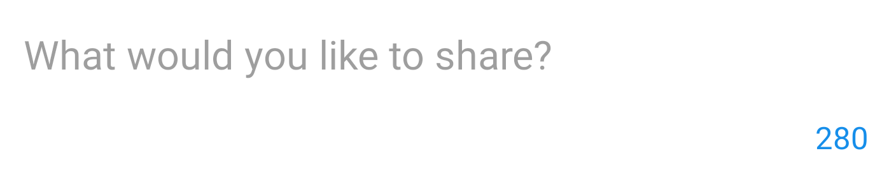

# Android Components

This library contains a shared set of component used within our Android App.

Widgets
-------

### Rounded Rectanglular button

Usage:

    <org.buffer.android.widgets.RoundedButton
        android:id="@+id/button_save"
        android:text="@string/button_save_account_details"
        app:bufferButtonStyle="dark" />

bufferButtonStyle can be set to either dark, light or clear

### Counter View

For more information on the counter view, please see the repository [here](https://github.com/bufferapp/CounterView)

Dimensions
----------

- Font sizes
- Corner radius

Colors
------

- Buffer brand colors

Styles
------

- Font Styles

TBC
